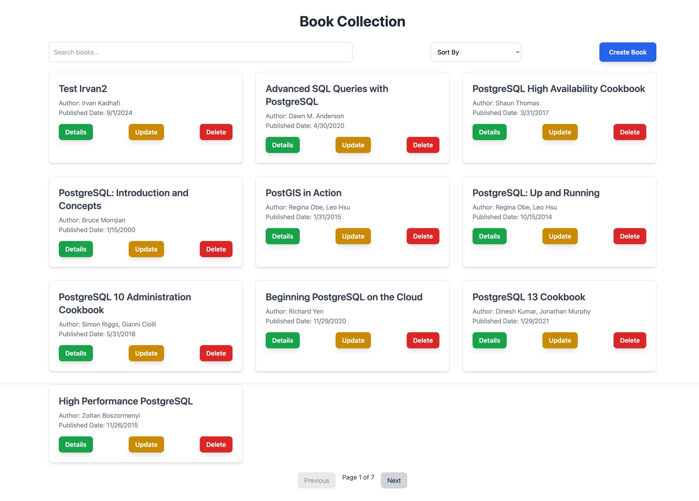

# Book Simple Project




This repository contains a simple project consisting of a backend service (`book-api`) and a frontend service (`book-frontend`). The project uses Docker Compose to manage and orchestrate the containers.

## Project Structure

- `book-api/` - The backend service built with FastAPI.
- `book-frontend/` - The frontend service built with Vue.js.
- `docker-compose.yml` - Docker Compose configuration file for managing the containers.

## Prerequisites

- Docker
- Docker Compose
- **Python**: 3.10.14 (tested on macOS M3 Pro with Miniconda)
- **Node.js**: v20.17.0

## Getting Started

### 1. Build and Run the Services

To build and start the services, run:

```bash
docker-compose up --build
```

This command will build the Docker images and start the containers for both `book-api` and `book-frontend`.


...
